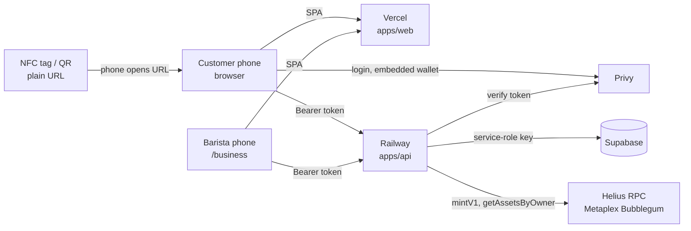

# HeroPad

Stamp-card loyalty for cafés and any local business with regulars. The customer's card is a browser tab, the
barista's counter is a phone, and a completed card mints a compressed NFT
trophy on Solana that the customer keeps in a wallet they never had to set up.

[](https://heropad.supervictoruniverse.com)
[](https://developers.metaplex.com/bubblegum)
[](https://euipo.europa.eu)

**Who it is for.** Independent cafés, bakeries, barbers, gyms and similar local
businesses that run a paper stamp card today, and their regulars. First market: Romania. The café pays a monthly fee invoiced in lei; the
customer pays nothing.

**What problem it removes.** Paper cards get lost, stamps get forged with a
pen, and the café learns nothing about who came back. HeroPad keeps the card
on the customer's phone with no app install, lets the barista grant a stamp
from their own phone in one tap, and turns a completed card into a permanent
collectible memento. Trophies are loyalty items: nothing in the code sells,
prices or trades them.

**History.** First submitted to the Solana Frontier hackathon in May 2026 as
a figurine-claim demo; the loyalty product on top of it is what runs today.

---

## How it fits together



A stamp is a Postgres row. A completed card is a `mintV1` into one
admin-owned Bubblegum tree (depth 14, 16,384 leaves, ≈ 0.06 SOL once; each
mint is one transaction fee). The customer's wallet is a Privy embedded
Solana wallet created at first login; HeroPad never holds user keys.

Full detail, diagrams, data model, cost arithmetic and an honest list of
known gaps: **[docs/ARCHITECTURE.md](docs/ARCHITECTURE.md)**.

---

## Run locally

Requires Node ≥ 20 and npm ≥ 10 (npm workspaces).

```bash
git clone https://github.com/dnsv123/heropad.git
cd heropad
npm install                      # installs apps/* and packages/* workspaces

cp .env.example .env             # fill in the names listed in the file; never commit .env
                                 # web needs VITE_PRIVY_APP_ID, VITE_API_BASE_URL
                                 # api needs SUPABASE_URL, SUPABASE_SERVICE_ROLE_KEY,
                                 #   PRIVY_APP_ID, PRIVY_APP_SECRET, SOLANA_RPC_URL,
                                 #   SOLANA_ADMIN_PRIVATE_KEY, HMAC_SECRET

npm run dev --workspace apps/web   # Vite on :5173
npm run dev --workspace apps/api   # tsx watch, Express on :8787
# or both at once from the root:
npm run dev
```

Database: apply `packages/db/migrations/001…023` in order in the Supabase
SQL editor (there is no migration runner). `packages/db/seeds/loyalty_test_venue.sql`
creates a test café.

Trophy tree: one per cluster. Create it from **Admin → Network** in the web
app (`POST /api/admin/solana/tree`) once `SOLANA_RPC_URL` and the admin key
are set, or run `tsx apps/api/scripts/create-tree.ts` with the same env; both
store the address under the cluster's key in `solana_config`.

Health: `GET /healthz` reports which cluster the API is pointed at.

---

## Stack

| Layer | Tech |
|---|---|
| Web | Vite + React 18 + TypeScript + Tailwind, SPA on Vercel |
| Auth and wallets | [Privy](https://privy.io): email, Google, external Solana wallet; embedded Solana wallet per user |
| API | Express + TypeScript on Railway, single instance |
| Database | Supabase Postgres, RLS, service-role access only from the API |
| Chain | Solana via [Helius](https://helius.dev) RPC; [Metaplex Bubblegum](https://developers.metaplex.com/bubblegum) compressed NFTs; Helius DAS for ownership |
| Invoicing | Oblio (Romanian e-invoicing), dry-run by default |
| Ops | GitHub Actions: nightly `pg_dump` backup, monthly restore test, billing cron, Supabase keep-alive |

---

## Repo layout

```
apps/
  web/                    React SPA (Vercel)
    src/pages/            Home, Loyalty, Business, Profile, Passport, Rewards,
                          Admin, Partner, Claim, Play, Privacy, Terms
    src/components/       counter, cards, admin tabs (AdminNetwork, AdminBilling, …)
    src/lib/              auth.tsx (lazy Privy bridge), privy.ts, explorer.ts, plans.ts
    src/services/         apiClient, offlineQueue (idempotent grant replay)
    public/cnft/          static trophy / passport metadata JSON
  api/                    Express API (Railway)
    src/routes/           loyalty, admin, rewards, partner, user, billing, claim, mint (501)
    src/lib/              metaplex (mint + tree), solana-admin, helius, supabase-admin,
                          loyalty-db, staff-db, passport-db, partners-db, billing-db, oblio, hmac
    src/middleware/       auth (Privy verify), claim-limit
    scripts/              create-tree, seed-codes, retro-mint-trophies (one-shots)
packages/
  shared/                 cross-process types
  db/migrations/          001_initial_schema … 023_billing_period (applied by hand)
  db/seeds/               loyalty_test_venue.sql
docs/                     ARCHITECTURE.md, AI_ASSET_REGISTER.md
standard/                 Open Venue Credentials (draft 0.1): spec, JSON schemas,
                          examples, validator — the vendor-neutral format trophies
                          are moving to; MIT, to become its own repository
.github/workflows/        db-backup, db-restore-test, billing, keepalive
```

---

## Roadmap

Only what is scheduled or planned; nothing below exists in the code yet.

- **This week (Sept 2026)** — production API moves from Helius devnet to
  mainnet; mainnet tree created from Admin → Network.
- **Next** — daily anchoring of the stamp ledger with a printable sealed
  report per venue (`docs/ANCHORING.md`, approved); trophies minted with
  metadata that conforms to the draft standard in `standard/` (per-asset
  JSON with venue, edition, date; the venue's well-known authority
  document); pre-orders inside HeroPad: the venue lists what can be ordered
  ahead, the customer writes the order and a pick-up time from the venue's
  card, the counter (owner and staff) sees it and marks it ready and handed
  over — the current "order-ahead link" only points at a system the venue
  already uses.
- **After the hackathon** — activities for BITS: a HeroPad-defined list the
  venue ticks, values set by HeroPad, paid only for server-verifiable
  behaviour or a proof reviewed by HeroPad; `manager` role; push
  notifications; Netopia card payments; a staging environment.
- **Later** — digital twins for physical products (pins, figurines, the
  comic, shop items): a code with the object claims its digital counterpart,
  which unlocks perks over time; tag-side NFC cryptography, permanent
  metadata storage, plan-based feature gating, multi-location cards.

---

## Trademark notice

The Super Victor character, V-mark, and SVU logo are registered trademarks of
**SVU Journey SRL**, EUIPO filing **019287298**. Use of these marks outside
the personal-display licence granted by the cNFT terms is prohibited.

---

## License

Code: MIT · Brand assets: All Rights Reserved · cNFTs: see `/terms` on the
live site.

Built with care in Sibiu by **SuperVictor Universe**.
