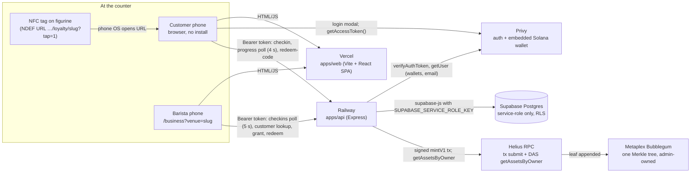
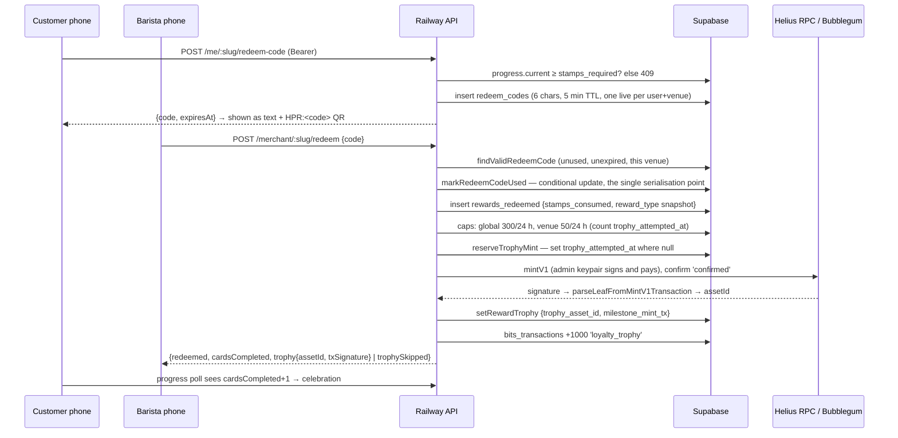

# HeroPad — Architecture

Written 2026-09-22 against `main`. Every statement below is checked against
the tracked source; file paths are relative to the repo root. Anything not yet
in the code is confined to section 10.

Vocabulary: a **trophy** is a compressed NFT minted as a loyalty memento when
a customer completes a stamp card. The code never sells, prices, lists or
transfers trophies; there is no marketplace integration. **BITS** are loyalty
points kept in a Postgres ledger; they are not a token. The customer-facing
product uses no crypto vocabulary at all; this document does.

---

## 1. What HeroPad is

HeroPad is a stamp-card loyalty system for cafés and other local businesses
with regulars, where the customer's card
lives in a browser tab, the barista's counter is a phone, and a completed card
produces a compressed NFT trophy on Solana. The customer signs in with email
or Google; a Solana wallet is created for them by Privy and they never see a
seed phrase. The café pays a monthly fee invoiced in lei; nothing on chain is
ever bought, sold or priced.

---

## 2. System overview



The browser never talks to Supabase or Solana directly. Every read and write
goes through the API. Metadata JSON for trophies is static and served by the
web app (`apps/web/public/cnft/*.json`).

---

## 3. Stamp flow

```mermaid
sequenceDiagram
  participant C as Customer phone
  participant B as Barista phone
  participant API as Railway API
  participant DB as Supabase

  C->>API: POST /api/loyalty/me/:slug/checkin (Bearer) — only when URL has ?tap=1
  API->>API: store {identityId, code, at} in process memory (3 min TTL)
  loop every 5 s while visible
    B->>API: GET /api/loyalty/merchant/:slug/checkins (Bearer)
    API-->>B: [{code, secondsAgo}] — newest auto-loaded if counter idle
  end
  B->>API: GET /merchant/:slug/customer/:code
  API->>DB: findIdentityByCode, getVenueProgress
  API-->>B: {stamps, required, canRedeem, birthdayToday}
  B->>API: POST /merchant/:slug/grant {code, count 1..5, requestId}
  API->>API: requireAuth → loadCounterVenue (owner or active staff)
  API->>DB: insert idempotency_keys (grant:venue:requestId) — dup ⇒ no-op
  API->>API: self-grant block; happy-hour multiplier from venue tz
  API->>DB: countStampsToday (venue-local day) vs cap 15 × multiplier
  API->>DB: insert count × multiplier rows into stamps (source='merchant')
  API-->>B: {granted, stamps, required, canRedeem}
  API-)DB: off-path: passport check, referral check, +2 BITS/stamp, clear check-in
  loop every 4 s while visible
    C->>API: GET /api/loyalty/me/:slug?wallet=… (Bearer)
    API-->>C: {stamps, cardsCompleted, …} → meter animates on change
  end
```

Prose. A stamp is a row in `stamps`; nothing touches the chain. The tap only
announces presence: the tag is a plain URL and the barista still has to press
grant. Grants are idempotent by `requestId`, so the counter can queue a grant
in `localStorage` while offline and replay it safely
(`apps/web/src/services/offlineQueue.ts`, grants only, 12 h max age).
Revoke (`POST /merchant/:slug/revoke`) marks `revoked_at`/`revoked_by` on the
newest stamp of the venue's local day; nothing is deleted. Balance is arithmetic, not a
card row: `live stamps − Σ rewards_redeemed.stamps_consumed`, clamped at 0
(`apps/api/src/lib/loyalty-db.ts` `getVenueProgress`).

Key files: `apps/api/src/routes/loyalty.ts` (grant ≈ lines 1762–1903,
check-in ≈ 1055–1141), `apps/web/src/pages/Loyalty.tsx`,
`apps/web/src/pages/Business.tsx`.

---

## 4. Reward and cNFT claim flow



Prose. The redemption always succeeds when the code is valid; the mint is
best-effort and never blocks the free coffee. If the customer has no cached
wallet, the caps are hit, or the mint throws, `trophySkipped` explains and the
row keeps `trophy_asset_id = NULL` for a later retro-mint. The mint itself
(`apps/api/src/lib/metaplex.ts`): Umi + `mplBubblegum`, `mintV1` with name
`SV Trophy — <venue> #<edition>` (32-char slice), symbol `SVTROPHY`, URI
`TROPHY_METADATA_URI` (default `https://heropad.supervictoruniverse.com/cnft/trophy.json`),
creator = admin key (verified, share 100), no collection (`verified: false`,
system-program key). Asset id comes from the transaction parser; the fallback
derives it from the tree's `sequenceNumber − 1` (see gap 8.9).

**Milestones on the way** (migration 025, `apps/api/src/lib/milestones-db.ts`):
a venue may define up to four small rewards below the full card, each with a
label and a 256 px photo (`venue_milestones`). The customer asks for one
with the same one-time reward code; the counter calls
`POST /merchant/:slug/redeem-options` to see what the code is good for, then
`POST /merchant/:slug/redeem` with `milestoneAt`. A claim is a row in
`milestone_claims`, unique per (customer, venue, milestone, card cycle); it
consumes no stamps, never resets the card, mints nothing and credits no
BITS. `rewards_redeemed` still means "full card", so every count built on
it is unchanged.

The same pipeline mints **passport** trophies at 3/5/8 distinct venues
(`runPassportAwards`, `apps/api/src/lib/passport-db.ts`), reserved by a
unique `(user_identity_id, tier)` row instead of `trophy_attempted_at`.

**Moving a trophy out** (`apps/api/src/lib/transfer.ts`, `MoveTrophy.tsx`):
the customer can send any trophy to a wallet they control elsewhere. Only
the leaf owner can authorise a Bubblegum `transfer`, and the embedded wallet
holds no SOL, so it is a three-step relay: `POST /api/user/transfer/prepare`
fetches the asset and its Merkle proof (DAS `getAssetWithProof`), checks the
tree is ours and the owner is one of the caller's linked wallets, builds the
transfer with the admin as fee payer and returns it half-signed; the browser
signs with Privy (`wallet.signTransaction`); `POST /api/user/transfer/send`
verifies the admin's own signature over the message bytes (so the relay
cannot be used for arbitrary transactions), submits and confirms. The profile
also shows the vault address with a copy button, a "verify" link per trophy
to the public explorer, and key export via Privy under "Technical details".

A separate, older **figurine claim** path exists: `POST /api/claim`
(`apps/api/src/routes/claim.ts`) requires a Privy token, verifies an
HMAC-signed code `HVPD-XXXX-XXXX:<hex>`, checks that the destination wallet
is linked to the caller, checks `claims` unique-on-code, mints via the same
function and credits 100 BITS. It is a demo path: no real codes are in
circulation and the landing lists it as "soon" (`Ecosystem.tsx` line 24).

---

## 5. Identity model

```
one human
  └─ one Privy DID (did:privy:…)              — login: email | google | external Solana wallet
       └─ one user_identity row (privy_id UNIQUE)   — apps/api/src/lib/loyalty-db.ts ensureIdentity()
            ├─ loyalty_code (6 chars, partial unique)   — what the barista sees
            └─ solana_wallet (cached, written once)     — the Privy embedded wallet
```

- `requireAuth` (`apps/api/src/middleware/auth.ts`) verifies the Privy access
  token on every `/me`, `/merchant`, `/admin`, `/partner`, `/rewards/me`
  route and sets `req.privyId`. There is no session of HeroPad's own.
- Linking a second login method to the same person happens inside Privy
  (`linkEmail`/`linkGoogle`/`linkWallet` in `ProfileWallet.tsx`). HeroPad
  does no matching by email or wallet.
- The wallet is Privy-managed (embedded, `walletChainType: 'solana-only'`,
  `createOnLogin: 'users-without-wallets'` in `apps/web/src/lib/privy.ts`).
  The loyalty page retries `createWallet()` once if login did not provision
  one. Any wallet address a client sends is checked against Privy's linked
  accounts before use (`getUserSolanaWallets`).
- Roles are rows, not claims in a token: `venues.owner_identity_id`,
  `venue_staff` seats (activated with an 8-char code, 48 h TTL), `partners`,
  and `ADMIN_PRIVY_IDS` (env allowlist, empty = nobody).

**What HeroPad never holds**

- User private keys or seed phrases. The web app only calls Privy's
  `createWallet()`, `exportWallet({ address })` and `signTransaction` (for
  moving a trophy out); the API never sees key material. (`solana_wallets.encrypted_private_key` from migration 001 has
  no reader or writer.)
- Passwords. Login is Privy's.
- Card or bank details. There is no payment code in the repo; the café is
  invoiced (section 9) and pays by transfer.
- Email by default. It is read from Privy on demand; it is stored in
  `user_identity.marketing_email` only after explicit opt-in consent, and
  the address comes from Privy, never from the request body.
- Birthdays beyond day + month.

The one key HeroPad holds is its own admin keypair (`SOLANA_ADMIN_PRIVATE_KEY`),
which owns the tree, signs and pays every mint.

---

## 6. Data model

Single Postgres schema `public` on Supabase. Every table has RLS enabled with
one `service_role` policy; the browser has no database credential. Migrations
`packages/db/migrations/001…023` are applied by hand in the SQL editor; all 23
are applied to production, in order.

| Table | Purpose | Columns and indexes that carry the logic |
|---|---|---|
| `venues` | One café. | `slug` UNIQUE; `stamps_required`; `branding` jsonb (reward label, happyHour, accent, logo…); `owner_identity_id`; `claim_token` + `claim_expires_at` (partial unique); `timezone`; `billing_status`, `billing_period`, `monthly_fee`, `plan`, `staff_seats`; `referred_by → partners`. |
| `user_identity` | One row per Privy DID. | `privy_id` UNIQUE; `loyalty_code` partial unique; `solana_wallet`; consent and birthday columns. |
| `stamps` | One row per stamp. | `user_identity_id`, `venue_id`, `source` (check constraint), `granted_by`, `created_at`, generated `stamp_day` (UTC date), `revoked_at`/`revoked_by`. Partial index on live rows per venue. |
| `rewards_redeemed` | One row per consumed card. | `stamps_consumed`, `reward_type` (label snapshot), `trophy_attempted_at` (mint reservation), `trophy_asset_id`, `milestone_mint_tx`. |
| `redeem_codes` | 5-minute proof-of-presence codes. | Partial uniques: live `code`; live `(user_identity_id, venue_id)`. `used_at` consumed by conditional update. |
| `idempotency_keys` | Grant replay guard. | `key` PK (`grant:<venue>:<requestId>`), `scope`, `created_at`; pruned to 30 days by the daily cron. |
| `venue_staff` | Counter seats. | `(venue_id, identity_id)` UNIQUE; `claim_token` + expiry; `role` (`staff`/`manager`, no behavioural difference); `active`. |
| `passport_awards` | Cross-venue tiers. | `(user_identity_id, tier)` UNIQUE = the reservation; `trophy_asset_id`, `mint_tx`. |
| `bits_transactions` | Append-only points ledger, keyed by wallet. | `wallet_address`, signed `amount`, `reason`, `metadata`; balance = SUM. |
| `reward_items`, `reward_claims` | BITS catalogue and 6-char pickup codes (14-day TTL). | Partial uniques on one pending per `(user, reward)` and live `code`. |
| `partners`, `partner_payouts` | Referral partners and monthly statements. | `code` UNIQUE; `(partner_id, period)` UNIQUE. |
| `venue_billing`, `venue_invoices` | Invoice details; one reservation row per `(venue_id, period)` written before Oblio is called. | `(venue_id, period)` UNIQUE is the double-invoice guard. |
| `admin_audit_log`, `erasure_log` | Every admin support lookup/export/erase; GDPR erasure proof with hashed subject. | |
| `solana_config` | Key/value: `bubblegum_tree` (devnet), `bubblegum_tree_mainnet`. | |
| `collectibles_catalog`, `claims`, `characters` | Figurine claim demo path. | `claims.code` UNIQUE. |

Concurrency is handled with constraints and conditional updates, not
transactions: unique indexes for reservations, `update … where <col> is null`
for single-use codes and mint reservations, `23505` treated as "someone got
there first".

---

## 7. Why compressed NFTs

A regular Solana NFT is three rent-paying accounts (mint, metadata, master
edition). A compressed NFT is one leaf in a Merkle tree; the tree account is
paid for once and each mint is a normal transaction that appends a leaf. State
is reconstructed by a DAS indexer (Helius), which is why the same RPC URL
serves both transaction submission and `getAssetsByOwner`.

**Tree in the code** (`apps/api/src/lib/metaplex.ts`, `scripts/create-tree.ts`):
`maxDepth 14`, `maxBufferSize 64`, `public: false`. Capacity 2^14 = 16,384
leaves. The create-tree comment puts rent at ≈ 0.06 SOL one-time; the
`createBubblegumTree` comment says to verify on mainnet. `canopyDepth` is not
set; the library default applies.

**Per mint.** `mintV1` is one transaction with one signer (the admin key).
ASSUMPTION (2026-09-22), verify: base fee 5,000 lamports = 0.000005 SOL, no
priority fee. No per-leaf rent.

**Arithmetic for 10,000 trophies** (one tree suffices):

| | Compressed (this code) | Regular NFT | Typical L1 |
|---|---|---|---|
| Fixed | tree ≈ 0.06 SOL | none | none |
| Per item | 0.000005 SOL (fee) | ≈ 0.01 SOL+ rent + fee — ASSUMPTION, verify | ≈ $1+ per mint — ASSUMPTION, verify |
| 10,000 items | 0.06 + 10,000 × 0.000005 = **0.11 SOL** | 10,000 × 0.01 = **100 SOL+** | **$10,000+** |

At an assumed 150 USD/SOL (ASSUMPTION (2026-09-22), verify) that is about
$17 for ten thousand trophies against roughly $15,000 for regular NFTs.
Whatever the price, the ratio is about 900:1 and the fixed cost dominates.
The daily global cap of 300 mints (`TROPHY_GLOBAL_DAILY_CAP`) bounds the
admin wallet's exposure to 300 × 0.000005 = 0.0015 SOL/day plus priority
fees.

The trade-off: trophies are not in a verified collection (gap 8.9), and
ownership queries depend on an indexer rather than on-chain accounts.

---

## 8. Security and trust boundaries as implemented

**Holds today**

- The browser holds no database credential; every write goes through the API
  with the service-role key. Supabase RLS admits only `service_role`.
- Identity on every protected route is a verified Privy token. Wallet
  addresses from the client are checked against Privy before use.
- Only a venue owner or an active staff seat can grant, revoke or redeem
  (`loadCounterVenue`). The customer page has no grant endpoint. Self-grant
  and self-redeem return 403.
- Redemption requires a 5-minute code generated on the customer's phone,
  consumed with a conditional update; one live code per card.
- Every mint is reserved before it is paid for (`trophy_attempted_at`,
  passport unique row) and capped at 50 per venue and 300 globally per
  rolling 24 h. Caps count attempts, so in-flight spend is included.
- Activation codes (owner, staff, partner): 8 chars from a 31-symbol alphabet,
  expiring, partial-unique, consumed atomically, 10 attempts/hour per account
  (`apps/api/src/middleware/claim-limit.ts`).
- Admin is an explicit DID allowlist that fails closed; lookups, exports and
  erasures are audit-logged with a hashed subject.
- Secrets are never logged; startup prints presence only. `helmet()`, 256 KB
  body limit, per-router rate limits, CORS allowlist without wildcards.
- Merchant-supplied URLs are https-only and re-validated client-side.
- Invoicing is dry-run unless `OBLIO_DRY_RUN` is exactly `"0"`; production is
  `1` today and no real invoice has been issued.

**Known gaps** (honest list; none is hidden by the UI)

1. `POST /api/claim` (the figurine demo path) requires a signed-in caller
   and mints only to a wallet linked to that account; a leaked
   code+signature pair alone is not enough. No real codes are in circulation.
2. The NFC tag is a plain NDEF URL (`…/loyalty/<slug>?tap=1`) on
   NTAG213/424 stickers with no tag-side security; the URL can be copied.
   The tap only announces presence; stamps are still granted only from the
   counter, but the auto-load reduces the barista's check to "did I just
   serve this person".
3. In-memory state (check-ins, every rate-limit store, the `/api/user/me`
   cache) assumes the single Railway instance that runs today and is lost on
   redeploy.
4. Daily stamp cap, the correction window, happy hour and birthday all use
   the venue's `timezone` now; the `stamp_day` column (UTC) remains for
   reporting only. On a DST switch day the cap window is one hour off.
5. No staging environment. Development runs against production data behind
   the service-role key.
6. Privy wallet export exists in the UI but has not been tested end to end.
7. Trophies carry no verified collection (`collection.verified: false`,
   system-program key); wallets show them uncollected. Profile listing
   filters by tree address instead (`apps/api/src/lib/helius.ts`).
8. `scripts/retro-mint-trophies.ts` bypasses `reserveTrophyMint` and both
   caps; a row whose mint succeeded but whose `setRewardTrophy` write failed
   can be minted twice. It has never been run against production.
9. Asset-id fallback in `metaplex.ts` reads the tree's `sequenceNumber` after
   the fact; two concurrent mints that both fall back can swap asset ids.
   The primary parser runs first, so this only bites when parsing fails.
10. `markRedeemCodeUsed` and `redeemReward` are two statements without a
    transaction; a crash between them consumes the code without writing the
    reward.
11. One hot admin key in a Railway env var owns the tree and pays every
    mint; no rotation or spend limit beyond the daily caps.
12. Two ways to create a tree exist (`scripts/create-tree.ts` and Admin →
    Network); both write the per-cluster key via `treeConfigKey()`, but
    nothing stops the two from being run on different machines pointed at
    different RPC URLs. Use one of them per cluster.
13. Off-chain metadata is mutable JSON on Vercel, not immutable storage.
14. CSP has no `script-src`; XSS protection relies on React escaping. Venue
    logos are merchant-supplied data URLs.
15. `idempotency_keys` is pruned to a 30-day window by the daily cron; a
    retry older than that is treated as a new request.
16. `manager` staff role is stored but grants nothing beyond `staff`.
17. No automated tests and no CI on push; the only CI is the monthly restore
    test.
18. Supabase free tier: no point-in-time recovery. Mitigation is the nightly
    `pg_dump` to a 30-day GitHub artifact.

---

## 9. Deployment topology

| Piece | Where | How |
|---|---|---|
| Web | Vercel, project alias `heropad.vercel.app`, canonical `heropad.supervictoruniverse.com` | `vercel.json`: builds `apps/web`, serves `dist`, rewrites all non-`/api/` paths to `index.html`, security headers. Auto-deploys from `main`. No preview environment. |
| API | Railway, single instance, `heropadapi-production.up.railway.app` | `apps/api/railway.json`: Nixpacks, `npm run build`, `node dist/index.js`, health `/healthz` (reports derived cluster). Auto-deploys from `main`. |
| Database | Supabase free tier, EU region | Service-role key only. Migrations applied by hand. `keepalive.yml` pings `/api/loyalty/venues` every 6 h because the free tier pauses. |
| Backups | GitHub Actions | `db-backup.yml` daily 02:23 UTC `pg_dump` to a 30-day artifact; `db-restore-test.yml` monthly restore into a throwaway Postgres asserting ≥ 15 tables and non-empty `venues`/`user_identity`/`stamps`. |
| Solana | Helius RPC via `SOLANA_RPC_URL` | Production points at Helius **devnet** today; the mainnet move is scheduled for the week of 2026-09-22. The tree key is per cluster (`solana_config.bubblegum_tree` / `bubblegum_tree_mainnet`), created from Admin → Network (`POST /api/admin/solana/tree`). `BUBBLEGUM_TREE_ADDRESS` is an override, normally unset. Explorer links use `VITE_SOLANA_CLUSTER`. |
| Auth / wallets | Privy | `PRIVY_APP_ID` / `PRIVY_APP_SECRET` server-side; `VITE_PRIVY_APP_ID` in the bundle. |
| Invoicing | Oblio (Romanian e-invoicing) | `billing.yml` daily 07:00 UTC `POST /api/billing/cron` with `x-cron-secret`. `OBLIO_DRY_RUN=1` in production. |
| Analytics | Vercel Analytics component in `App.tsx` | Whether the dashboard toggle is on is unclear. |

Env separation: development loads the repo-root `.env`; production values
live in the Vercel and Railway dashboards. Only `VITE_*` names reach the
browser. Server-only names in use: `SUPABASE_URL`, `SUPABASE_SERVICE_ROLE_KEY`,
`SOLANA_RPC_URL`, `SOLANA_ADMIN_PRIVATE_KEY`, `BUBBLEGUM_TREE_ADDRESS`,
`PRIVY_APP_ID`, `PRIVY_APP_SECRET`, `HMAC_SECRET`, `ADMIN_PRIVY_IDS`,
`CORS_ALLOWED_ORIGINS`, `BILLING_CRON_SECRET`, `OBLIO_*`, `LOYALTY_DAILY_CAP`,
`TROPHY_DAILY_CAP`, `TROPHY_GLOBAL_DAILY_CAP`, `STAMP_BITS_REWARD`,
`TROPHY_BITS_REWARD`, `PASSPORT_BITS_*`, `PASSPORT_METADATA_URI_*`,
`TROPHY_METADATA_URI`, `REFERRAL_BITS_*`, `REFERRAL_DAILY_CAP`. Daily caps run
at their code defaults (15 stamps/customer/venue/day, 50 trophies/venue/day,
300 global/day).

---

## 10. Planned, not yet implemented

None of the following exists in the code. Listed so that nobody reads it into
the sections above.

- **Mainnet cut-over** — scheduled for this week: switch `SOLANA_RPC_URL`,
  create the mainnet tree from Admin → Network, set `VITE_SOLANA_CLUSTER`.
- **Credential standard** for trophies (a verified collection or an
  attestation format so third parties can check "earned at venue X").
- **Daily anchoring** of the off-chain stamp ledger (a periodic hash of the
  day's `stamps` rows written on chain).
- **Push notifications** (no service-worker push, no email provider; the
  newsletter is a consented CSV export).
- **Netopia card payments** for the café's subscription (today: invoice and
  bank transfer, dry-run).
- **`manager` role** with permissions distinct from `staff`.
- **Digital twins for physical products** — pins, figurines, the comic and
  shop items ship with a claim code; claiming mints the object's digital
  counterpart into the customer's vault, and that counterpart unlocks perks
  over time (BITS, game items, access). The figurine claim path in section 4
  is the seed of this.
- **Staging environment** (separate Supabase project and Railway service).
- Also referenced in comments or the admin guide, absent from code:
  `POST /api/mint` (501 stub), tag-side NFC cryptography and `ntag_tap`
  stamps, permanent metadata storage (Arweave/IPFS), plan-based feature
  gating, multi-location cards, Apple/Google Wallet passes, Hall of Heroes
  identity linking, marketplace or royalty enforcement (nothing in code
  lists or sells trophies; `sellerFeeBasisPoints` 500 is a metadata field
  only).
